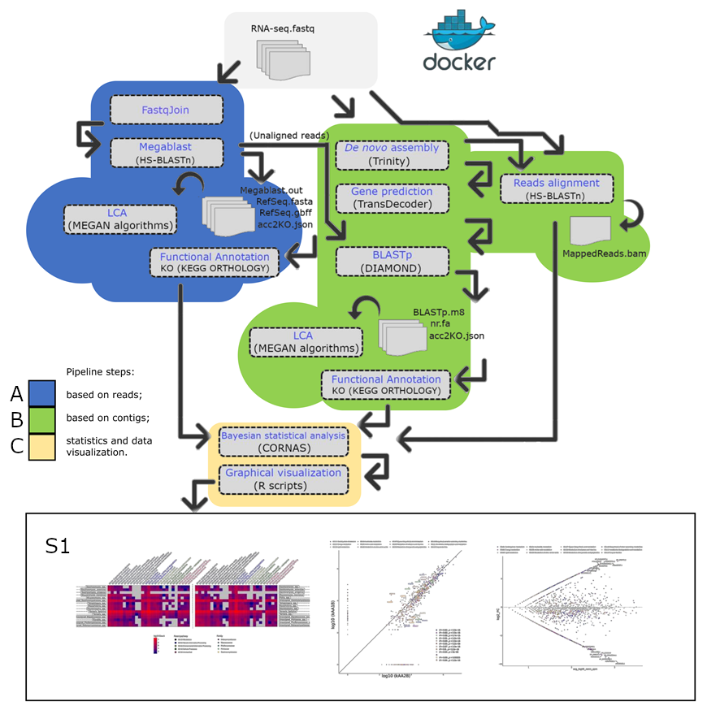

# McFREE

MCFREE is a rapid, automated, and efficient metatranscriptome pipeline for analyzing large RNA-seq datasets in Docker containers for supercomputing cluster environments. MCFREE was born out of a need for metatranscriptome without repetition, annotated, and free of chimeras using the Megablast algorithm for taxonomic annotation.

